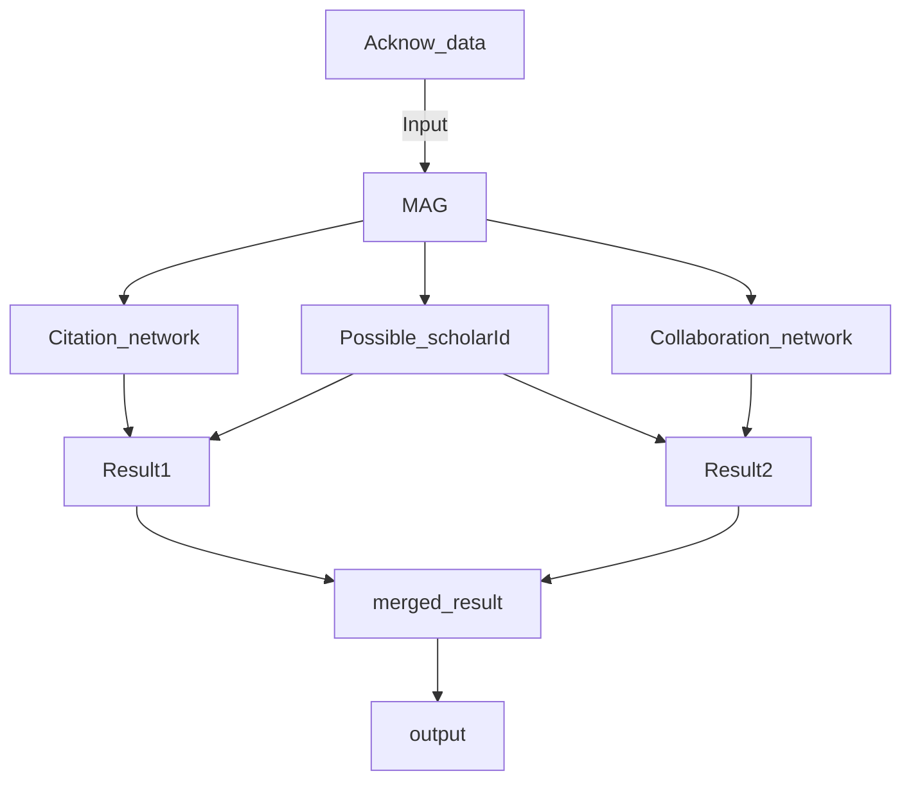

# acknow-identification


This is the script implemented in the [article](https://www.nature.com/articles/s41597-022-01585-y). This is the code to identify acknowledged individuals registered in the Academic database (Microsoft Academic Graph is in the article).

The codes were implemented by python3.9 but are possiblly executable with other versions.

# Files 
The main scripts consist of 2 files: [Preprocessing.py](https://github.com/Keygoksmg/acknow-identification/blob/main/scripts/preprocessing.py) & [Detector.py](https://github.com/Keygoksmg/acknow-identification/blob/main/scripts/detector.py).

## Preprocessing
This class checks the data format beforehand for a smooth analysis. Specifically, it will see 1) whether necessary column/data exist in the required dataset and 2) the possibility that the interesting acknowledged names can be identified with specified DB data. 

Current scripts require 4 datasets(e.g., Authors, Paper_Author, and Paper_RefPaper.) of bibliometric DB, such as MAG, on local. However, you may need to modify that large-size data in order to implement these scripts. Therefore, I briefly note the process of handling the large dataset. In particular, I use the module of vaex to deal with this problem, so please check it.

## Detector
This class implements core argorthm (see [article](https://www.nature.com/articles/s41597-022-01585-y)). 

AuthorId entirely depends on which DB you use. In the article, MAG(Microsoft Academic Graph) is used.
We only require DOI and acknowledged scholar names.

By inserting them into the DB, we will get possible scholarly IDs having the acknowledged scholar names.
Then, going through the algorithm proposed in the article, we identify the acknowledged scholar ID.
This method requires the hypothesis that DB(in this case MAG) has solved name disambiguation problems about the author's names with a well-developed algorithm and idea that acknowledged scholars have academic records in the DB.

Conversely, acknowledged individuals whose records do not exist in DB cannot be detected (e.g., parents and private friends). As another limitation, acknowledged scholars who have not collaborated with acknowledging authors or have not been cited in the article also cannot be identified. 

# Required dataset
The scripts require the following dataset. 
All of them are .csv or table data. The example data is in the folder of [example/](https://github.com/Keygoksmg/acknow-identification/tree/main/example)

- ```df_acknow```: the input dataset. [(example)](https://github.com/Keygoksmg/acknow-identification/blob/main/example/exampleAcknow/example_df_acknow.csv)
    - This data should have at least the columns of [Doi, AcknowName]. (Here, AcknowName = Acknowledged scholar name).
    - AcknowName should be separated by '_' e.g., "Hanah_Margalit".


- ```db_author```: DB data regarding authors. [(example)](https://github.com/Keygoksmg/acknow-identification/blob/main/example/exampleDB(mag)/example_db_author.csv)
    - This data should have at least the columns of [AuthorId, DisplayName].

- ```db_paper_author```: DB data regarding paper and its authors. [(example)](https://github.com/Keygoksmg/acknow-identification/blob/main/example/exampleDB(mag)/example_db_paper_author.csv)
    - This data should have at least the columns of [PaperId, AuthorId].

- ```db_paper_refPaper```: DB data regarding cited papers. [(example)](https://github.com/Keygoksmg/acknow-identification/blob/main/example/exampleDB(mag)/example_db_paper_refPaper.csv)
    - This data should have at least the columns of [PaperId, Rfpid]. Rfpid is the Id that PaperId cites. Therefore, Rfpid is part of PaperId. 

- ```df_doi_paperId```: DB data that map from doi to DB's paperId. [(example)](https://github.com/Keygoksmg/acknow-identification/blob/main/example/exampleDB(mag)/example_df_doi_paperId.csv)
    - This data should have at least the columns of [Doi, PaperId].


Regarding DB data, we used [mag data](https://www.microsoft.com/en-us/research/project/microsoft-academic-graph/).


# Data process flow
The Detector class manages the core part of the algorithm. First, with the input acknowledgment dataset, it will create the 3 types of sub-datasets (Citation network, Collaboration network, and Possible scholarId) based on MAG. Then, merging those sub-datasets will produce output.



# Demo
There are example codes in a [notebook](https://github.com/Keygoksmg/acknow-identification/blob/main/example/example.ipynb) and [.py](https://github.com/Keygoksmg/acknow-identification/blob/main/example/example.py) files to demonstrate the usage of the programs. Both have the same usage, so please choose one for your convenience.
After executing one of the demo files, output data will be saved as CSV (e.g., example_results.csv).